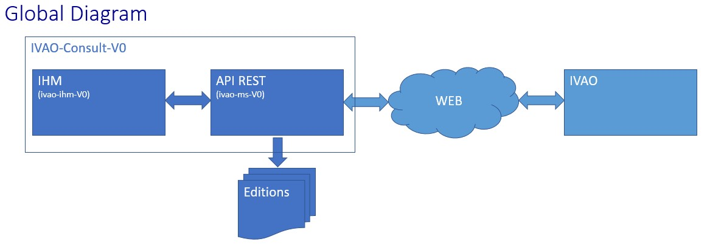
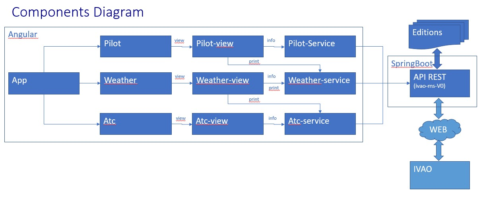

# IVAO CONSULT V0 - IvaoIhmV0

This project was generated with [Angular CLI](https://github.com/angular/angular-cli) version 11.0.2.

## Introduction
IVAO Consult is used to consult and print IVAO Weather, pilot and ATC informations from IVAO Web Site (https://wiki.ivao.aero/en/home/devops/api/documentation-v2)
* for Weather informations (observations and prévisions), airport id is required
* for Pilot informations, pilot user id is required. Those informations can be completed before printing
* for ATC informations, act user id is required.
After consultation, informations can be printed.

This part is IHM in Angular for IVAO CONSULT

## Use case Diagram

### Global Diagram

### Fonctional Diagram

## Prerequis
* IIS or nginx server
* API REST ivao-ms-v0 (with java 11) must be up (see https://github.com/E2lre/ivao-ms-v0)
* exceute   ng build --base-href "/ivao/" --prod

## Development server

Run `ng serve` for a dev server. Navigate to `http://localhost:4200/`. The app will automatically reload if you change any of the source files.

## Code scaffolding

Run `ng generate component component-name` to generate a new component. You can also use `ng generate directive|pipe|service|class|guard|interface|enum|module`.

## Build

Run `ng build` to build the project. The build artifacts will be stored in the `dist/` directory. Use the `--prod` flag for a production build.

## Running unit tests

Run `ng test` to execute the unit tests via [Karma](https://karma-runner.github.io).

## Running end-to-end tests

Run `ng e2e` to execute the end-to-end tests via [Protractor](http://www.protractortest.org/).

## Further help

To get more help on the Angular CLI use `ng help` or go check out the [Angular CLI Overview and Command Reference](https://angular.io/cli) page.
